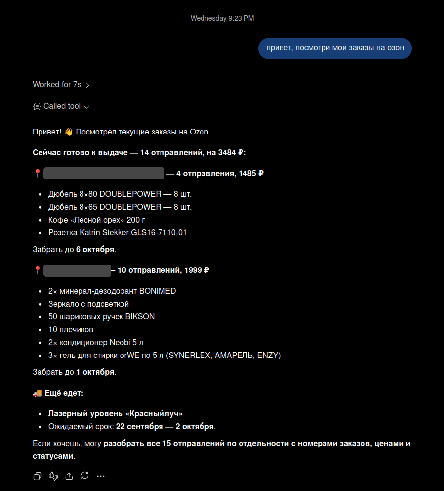

# ozon-mcp

MCP server for [Ozon](https://www.ozon.ru): product search, product details, reviews, photos and orders (read-only).

Requests to Ozon run inside an ozon.ru tab of an already running Chrome (via the Chrome DevTools Protocol),
so they use the browser's session, cookies and proxy, and Ozon's anti-bot lets them through.
Cookies are never extracted from the browser.

## Example

Asking a chat assistant connected to ozon-mcp to check current orders (it calls `orders_summary`):



## Tools

| Tool | What it does |
|---|---|
| `search_products(query, sort?, page?)` | search results: sku, name, price, old price, discount, rating, review count, delivery, link |
| `get_product(product, reviews?)` | everything about a product by link (including `ozon.ru/t/…` short links) or sku: brand, seller, availability, unit price, all characteristics, package contents, variants, description, photos, star distribution and reviews (20 by default) |
| `get_reviews(product, sort?, page?)` | reviews, 30 per page; `sort`: `useful`, `score_desc`, `score_asc` |
| `get_product_images(product, limit?, size?)` | product photos as images for the model; `size`: `small` (500 px, default), `medium` (1000), `original` |
| `orders_summary()` | what is waiting at pickup points (where, amount to pay, pick-up deadline) and what is in transit (how long to wait) |
| `list_orders(tab?, pages?, with_items?)` | orders by shipment; `tab`: `active` or `archive` |
| `get_order(order_number)` | order details: date, payment, address, items with sellers, prices and quantities |

Search `sort`: `score` (default), `price`, `price_desc`, `rating`, `new`, `discount`.

Orders are read-only. The order pickup code is intentionally never returned: it can be used to collect parcels.

Tool descriptions and responses are in Russian, like Ozon itself.

## Requirements

- Node.js 22+
- Chrome/Chromium with a remote debugging port (`--remote-debugging-port=9222`), logged in to Ozon
- [Proxy Tunnel](https://github.com/oleg909902/proxytunnel) if Chrome runs on a server (see below)

### Why Proxy Tunnel

Ozon's anti-bot blocks or constantly challenges traffic from datacenter IPs, so a Chrome on a VPS
going out through the VPS's own IP doesn't work reliably. [Proxy Tunnel](https://github.com/oleg909902/proxytunnel)
is an Android app that turns a phone into the server's internet exit: it runs an HTTP proxy on the phone
and opens a reverse SSH tunnel, so `127.0.0.1:18081` appears on the server and everything sent to it
goes out through the phone's mobile network. Chrome on the server is launched with this proxy,
and Ozon sees an ordinary mobile IP.

```
ozon-mcp ──CDP (:9222)──► Chrome on the server ──proxy 127.0.0.1:18081──► reverse SSH tunnel
                                                                                │
                              Ozon ◄── mobile internet ◄── phone (Proxy Tunnel) ◄┘
```

Setup:

1. Set up the server and the phone as described in the [Proxy Tunnel README](https://github.com/oleg909902/proxytunnel#1-server-setup)
   and check that the tunnel is up: `curl -x http://127.0.0.1:18081 https://ifconfig.me` shows the phone's IP.
2. Launch Chrome on the server with the proxy and a local-only debugging port:

   ```bash
   google-chrome \
     --user-data-dir="$HOME/chrome-profile" \
     --proxy-server=http://127.0.0.1:18081 \
     --remote-debugging-address=127.0.0.1 \
     --remote-debugging-port=9222 \
     https://www.ozon.ru/
   ```

3. Log in to Ozon in this Chrome once (for example over VNC/RDP); the session is kept in the profile.
4. Point ozon-mcp at the debugging port: run it on the same server with `CDP_URL=http://127.0.0.1:9222`,
   or forward the port to your machine (next section).

If the phone disconnects, Chrome loses internet access and tools fail with network errors until the tunnel is back.
Never expose the debugging port to the internet: it gives full control over the browser and its Ozon session.

## Running

```bash
npm install
npm run build
npm start            # HTTP: http://127.0.0.1:3000/mcp (Streamable HTTP, for ChatGPT etc.)
npm run stdio        # stdio (for Claude Code, see .mcp.json)
```

Environment variables:

| Variable | Default | |
|---|---|---|
| `CDP_URL` | `http://127.0.0.1:9223` | HTTP address of Chrome's debugging port |
| `HOST` | `127.0.0.1` | HTTP server bind address |
| `PORT` | `3000` | HTTP server port |
| `OZON_REFRESH_MIN` | `20` | refresh anti-bot cookies every N idle minutes (`0` disables) |

### Chrome on a remote server

If Chrome runs on a server, forward its debugging port to local port 9223 over SSH:

```bash
ssh -M -S /tmp/chrome-cdp-ssh-%r@%h:%p -f -N -L 127.0.0.1:9223:127.0.0.1:9222 user@server
# close the tunnel:
ssh -S /tmp/chrome-cdp-ssh-%r@%h:%p -O exit user@server
```

### Docker

```bash
docker build -t ozon-mcp .
docker run --rm -p 3000:3000 -e HOST=0.0.0.0 -e CDP_URL=http://<chrome-host>:9222 ozon-mcp
```

## Project layout

```
src/
  index.ts              entry point: stdio or HTTP
  config.ts             environment variables
  cdp/                  minimal Chrome DevTools Protocol client
    connection.ts         WebSocket, commands and events
    browser.ts            tabs: list, open/close, evaluate JS, wait for a condition
  ozon/                 Ozon access
    client.ts             requests from an ozon.ru tab, request queue, anti-bot handling
    page-data.ts          page/json/v2 response and widget lookup
    format.ts             parsing prices, links, dates
    sku.ts                sku from an article number or link
  products/             search, product details, reviews, photos
  orders/               order list, details, summary, Russian dates
  mcp/                  MCP tool definitions
  transport/http.ts     Streamable HTTP on node:http
```

How it works:

1. `OzonClient` finds an ozon.ru tab (or opens one) and runs `fetch` inside it against
   `/api/entrypoint-api.bx/page/json/v2?url=<page>` — the JSON of any Ozon page, split into widgets.
2. Requests run strictly one at a time to trigger the anti-bot less often.
3. If Ozon responds with an anti-bot challenge, the challenge page is opened in a temporary tab,
   the browser passes it on its own, the tab is closed and the request is retried. While the server is idle,
   anti-bot cookies are refreshed the same way every `OZON_REFRESH_MIN` minutes.
4. The `products/` and `orders/` modules pick the widgets they need and turn them into plain objects.
